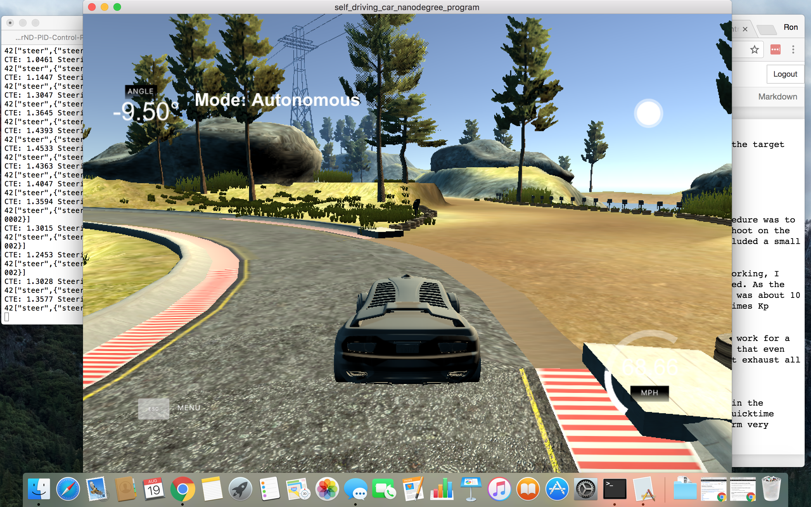
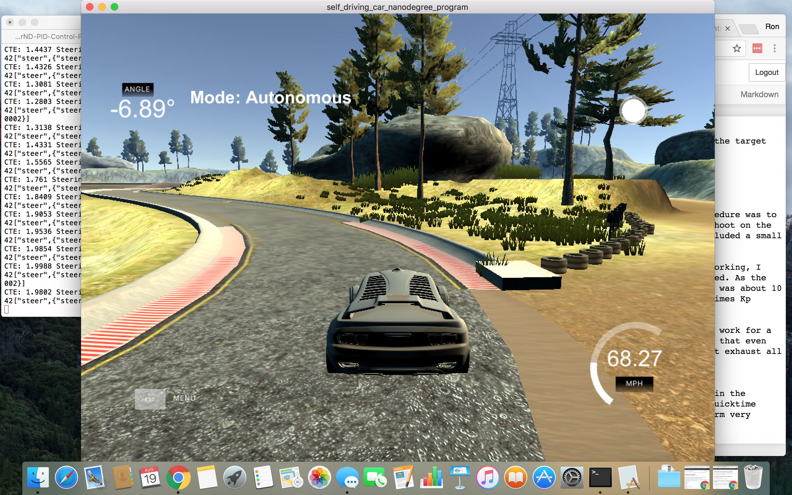
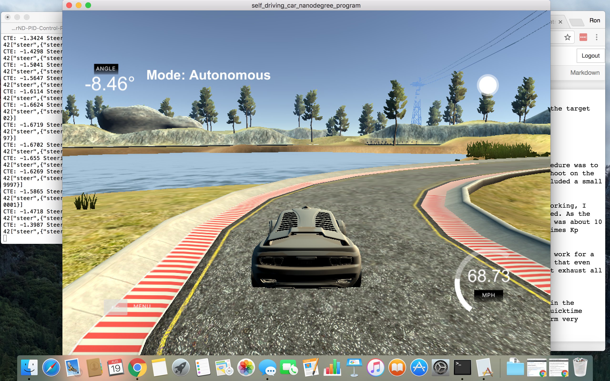
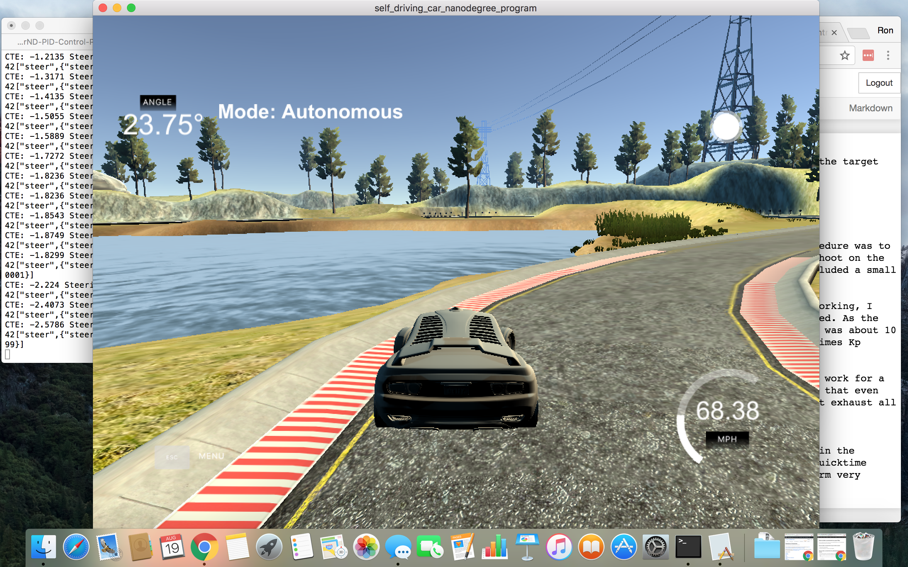
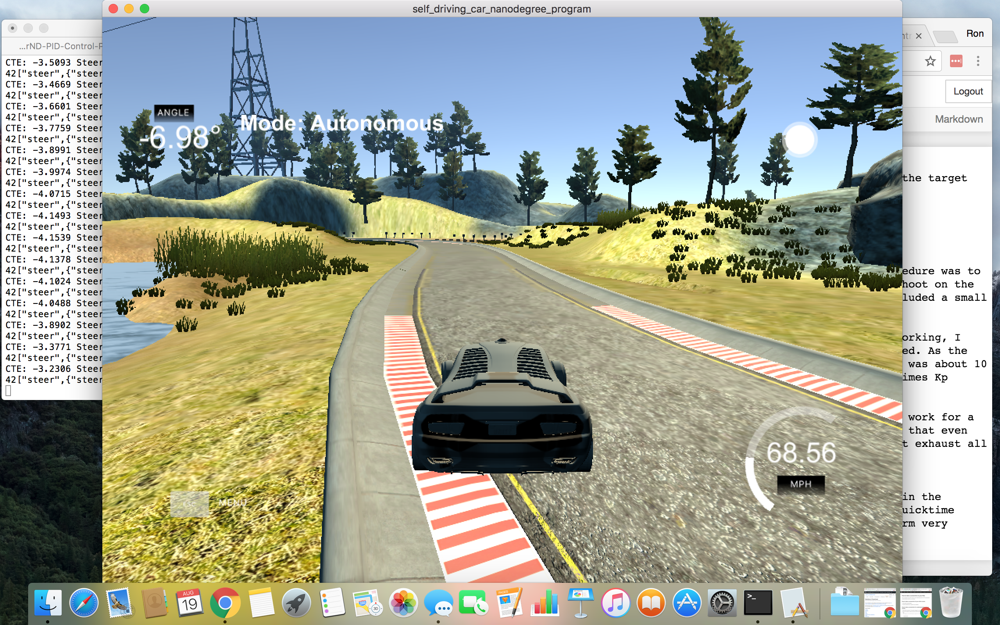
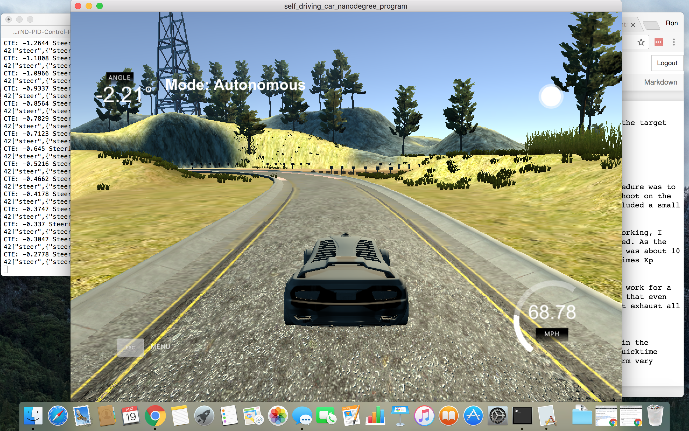

## PID Control Project

### Steering Controller
A PID controller was implemented for the steering, in the CalculateSteering() method. 

`steering = Kp*cte + Kd*D_cte + Ki*cte_int`

The controller consists of three terms. The first, the proportional component, `Kp*cte`, drives the error toward zero. However, it also tends to create overshoot. In order to smooth out the response, a derivative term is included, `Kd*D_cte`. The derivative term helps reduce the overshoot and dampens the overall response. The final term, the integral term, becomes important over long periods of time. The integral term is used to remove the windup error, which is the tendency for the controller to drift over time (i.e. develop a bias). 

### Speed Controller
A simple proportional only P-controller was used for adjusting throttle to achieve the desired speed. It can be found in CalculateThrottle(). It works by changing the throttle in proportion to the error in speed. 

`throttle = gain * (desired_speed - speed)`

This implementation worked very well for keeping the speed consistent. It remained close to, but slightly less than, the target speed. A more sophisticated controller was not needed. 

### Gain Tuning
For the speed controller, a proportional gain of 0.5 was used. 

The steering controller required much more effort and iteration. The procedure was to set the Kp gain such that there are small oscillations with a small overshoot on the straightaway. Then, add a Kd gain to smooth out the overshoot. I also included a small integral term to remove windup error. 

I obtained a working controller for a slow speed, 10 mph. Once that was working, I gradually increased the speed, getting the controller working at each speed. As the target speed went up, the Kd gain had to be increased. At slow speeds, it was about 10 times the Kp gain. At 50 mph, I used 20 times Kp. At 70 mph, a Kd of 40 times Kp worked well. 

At speeds of 90 mph and above, I found that I could get the controller to work for a single lap, but during the 2nd lap the car left the track. It is possible that even higher values of Kd may work for multiple laps at this speed, as I did not exhaust all the possbilities in my trials.

### Video
I was unable to record a video. The video recording function is disabled in the simulation when in autonomous mode. I attempted to record a video using Quicktime while running the simulator. However, this caused the controller to perform very poorly -- presumably due to computer processing limitations. 

### Screenshots
The following screenshots highlight the two most difficult turns on the course. **Turn 1** is the left turn that occurs about halfway or so through the course, with the open area on the right. **Turn 2** is the sharp right turn that occurs just after turn 1. 

#### Turn 1 
###### Before

###### After

#### Turn 2
###### Before

###### During

###### Coming out of the turn

###### Re-centered after recovery from turn
